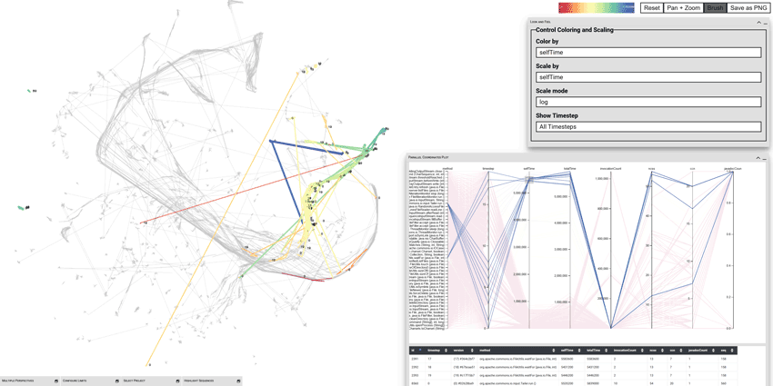

# evolution-paths

: https://vis-uni-bamberg.github.io/evolution-paths/



Runtime data of software systems is often of multivariate nature, describing different aspects of performance among other characteristics, and evolves along different versions or changes depending on the execution context.
This poses a challenge for visualizations, which are typically only two- or three-dimensional.
Using dimensionality reduction, we project the multivariate runtime data to 2D and visualize the result in a scatter plot.
To show changes over time, we apply the projection to multiple timestamps and connect temporally adjacent points to form trajectories.
This allows for cluster and outlier detection, analysis of co-evolution, and finding temporal patterns.
While projected temporal trajectories have been applied to other domains before, we use it to visualize software evolution and execution context changes as _evolution paths_.
We experiment with and report results of two application examples: (I) the runtime evolution along different versions of components from the _Apache Commons_ project, and (II) a benchmark suite from scientific visualization comparing different rendering techniques along camera paths.

## Installation

The application uses `npm` as the build system.

For local development clone the repository and run `npm run dev` to start the development server.

For building the application run `npm run build`.

A working copy containing all datasets is deployed under https://vis-uni-bamberg.github.io/evolution-paths/

## Cite this

This application is part of the supplementary material to the publication

> Hagen Tarner and Fabian Beck. 2023. Visualizing Runtime Evolution Paths in a Multidimensional Space (Work In Progress Paper). In Companion of the 2023 ACM/SPEC International Conference on Performance Engineering (ICPE ’23 Companion), April 15–19, 2023, Coimbra, Portugal. ACM, New York, NY, USA, 6 pages. https://doi.org/10.1145/XXXXXX.XXXXXX

to cite it, please use the following bibtex entry:

```bibtex
@INPROCEEDINGS{}
```
